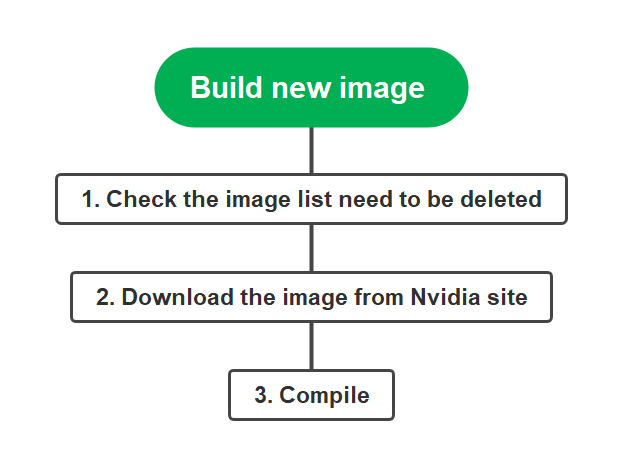

# Docker-file workflow
Docker file to build new image of DGX

## Step 1
### **The format of image info**

REPOSITORY |         TAG |                    IMAGE ID |      CREATED  |         SIZE
---|---|---|---|---|
nvcr.io/uoh053018/xubuntu-tc   |    yhu-1.6-1.9.0  |          787484901610 |  3 mon ths ago|    39.1GB

Log in and check the image version：
~$ docker run --gpus all -it --rm 6cf865861ca2 --bash

check the nvida version of old saved tf,this one need to be keeped.

1. [ Description. ](#desc)
2. [ Usage tips. ](#usage)

## 1. Description

sometext

## 2. Usage tips

sometext
